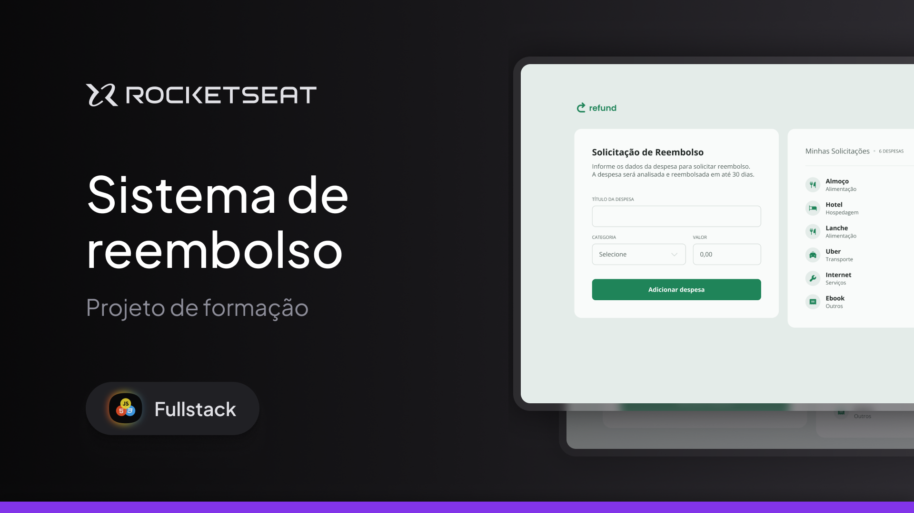

<h1 align="center"> Refund </h1>

  <a href="#-tecnologias">Tecnologias</a>&nbsp;&nbsp;&nbsp;|&nbsp;&nbsp;&nbsp;
  <a href="#-projeto">Projeto</a>&nbsp;&nbsp;&nbsp;|&nbsp;&nbsp;&nbsp;
  <a href="#-layout">Layout</a>&nbsp;&nbsp;&nbsp;|&nbsp;&nbsp;&nbsp;
  <a href="#memo-licença">Licença</a>

  

 

  

## 🚀 Tecnologias

Esse projeto foi desenvolvido com as seguintes tecnologias:

- HTML e CSS
- JavaScript
- Git e Github
- Figma

## 💻 Projeto

Refund é uma aplicação web de solicitação de reembolso e listagem de despesas.

## 🔖 Layout

Você pode visualizar o layout do projeto através [DESSE LINK]https://www.figma.com/design/ZDqhcrRTUnzVEbsCfr8UfI/Sistema-de-reembolso--Community-?node-id=0-1&p=f&m=dev. É necessário ter conta no [Figma](https://figma.com) para acessá-lo.

## :memo: Licença

Esse projeto está sob a licença MIT.

---

